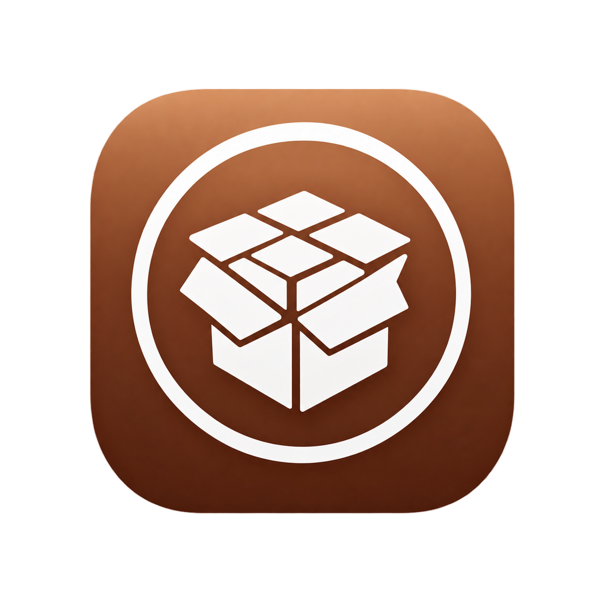

<h3 align="left">Welcome to cycket,  iOS 10.x Jailbreak for 32bit devices

 </h3> 
installation:
download the ipa then download sideloadly and import the ipa to the iphone but you need to entre your apple id account and password

By default this jailbreak does NOT install Zebra, instead it uses [cydia] https://cydia.saurik.com/

As with all jailbreaks, there is NO WARRANTY with this software, so use at your own risk. 

If you have an issue please report it via this repo's issues tab.
## Credits
  - [staturnz](https://github.com/staturnzz)
  - [kok3shidoll](https://github.com/kok3shidoll)
  - [planetbeing](https://github.com/planetbeing)
  - [cydiateam](https://cydia.saurik.com/)

